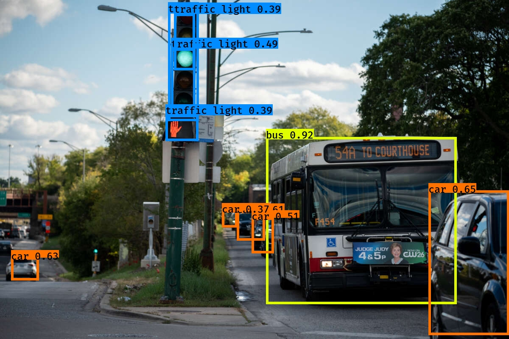

# Autonomous Vehicle Object Detection Using YOLO

[](https://www.google.com/)

## Project Overview

This project implements real-time object detection for autonomous vehicles using the YOLO (You Only Look Once) algorithm. The system can detect and classify multiple objects such as pedestrians, cars, motorcycles, and road features in a single forward pass, making it suitable for real-time applications in self-driving cars.

## Table of Contents

- [Background](#background)
- [Model Architecture](#model-architecture)
- [How YOLO Works](#how-yolo-works)
- [Evaluation Metrics](#evaluation-metrics)
- [Installation and Usage](#installation-and-usage)
- [Future Improvements](#future-improvements)
- [References](#references)

## Background

Object detection is a critical component of autonomous driving systems. Unlike simple image classification that only identifies what objects are present in an image, our system performs:

1. **Object Classification**: Identifying what objects are in the scene (pedestrians, cars, motorcycles)
2. **Object Localization**: Finding where these objects are located
3. **Object Detection**: Combining classification and localization for multiple objects in a scene

Traditional sliding window approaches are computationally expensive and slow. YOLO, introduced by Redmon et al. (2015), transforms object detection into a single regression problem, enabling real-time processing even on limited computational resources.

## Model Architecture

Our implementation uses a convolutional neural network backbone based on the YOLO architecture:

- **Input**: Camera frames of size 448x448x3
- **Output**: Bounding boxes with class probabilities
- **Grid System**: The input image is divided into an S×S grid (19×19 in our implementation)
- **Prediction Per Cell**: Each grid cell predicts:
  - B bounding boxes (x, y, w, h)
  - Confidence scores for those boxes
  - C class probabilities
- **Final Output Shape**: S×S×(B×5+C) where:
  - S×S is the grid size
  - B is the number of bounding boxes per grid cell
  - 5 represents (x, y, w, h, confidence)
  - C is the number of classes

## How YOLO Works

### Training Process

1. **Grid Assignment**: Each object in the training image is assigned to the grid cell containing the object's midpoint
2. **Bounding Box Prediction**: Each grid cell predicts B bounding boxes (x, y, w, h) and confidence scores
3. **Class Prediction**: Each grid cell also predicts class probabilities
4. **Anchor Boxes**: We use pre-defined anchor boxes to better handle objects of different shapes
5. **Loss Function**: Combined loss for localization error, confidence prediction, and classification error

### Inference Process

1. **Forward Pass**: A single forward pass through the network produces all bounding boxes
2. **Confidence Filtering**: Boxes with confidence below a threshold (0.6) are discarded
3. **Non-Maximum Suppression**: Multiple detections of the same object are eliminated by keeping only the highest confidence detection with IoU ≥ 0.5

### Anchor Boxes

To detect multiple objects whose centers fall within the same grid cell, we use anchor boxes:

- Each grid cell is associated with predefined anchor boxes of different shapes
- Objects are assigned to the anchor box with the highest IoU
- This approach improves detection of overlapping objects and objects with varying aspect ratios

## Evaluation Metrics

### Intersection over Union (IoU)

IoU measures the overlap between the predicted bounding box and the ground truth:

```
IoU = Area of Intersection / Area of Union
```

A prediction is considered "correct" if IoU ≥ 0.5

### Non-Maximum Suppression (NMS)

NMS is used to eliminate redundant detections:

1. Select the box with the highest confidence score
2. Compare it with other boxes and remove those with IoU ≥ 0.5
3. Repeat until no boxes remain

## Installation and Usage

```bash
# Clone the repository
git clone https://github.com/sskhandle/autonomous-driving-car-detection.git
cd autonomous-driving-car-detection

# Create a virtual environment
python -m venv venv
source venv/bin/activate  # On Windows: venv\Scripts\activate

# Install dependencies
pip install -r requirements.txt

# Download the following file and place it in /model_data/variables/
https://drive.google.com/file/d/1NgTlSXK7Ih5o09Dyg2cuIWRihoWLrIYj

# Run the notebook
jupyter notebook CNN_Autonomous_driving_Car_detection.ipynb
```

## Future Improvements

1. **Semantic Segmentation**: Integrate U-Net architecture for pixel-level classification
2. **Real-time Optimization**: Further optimize for edge devices in autonomous vehicles
3. **Multi-sensor Fusion**: Combine camera data with LIDAR and RADAR for improved detection
4. **Temporal Tracking**: Implement object tracking across video frames
5. **Faster Variants**: Explore R-CNN, Fast R-CNN, and Faster R-CNN architectures

## References

1. Redmon, J., Divvala, S., Girshick, R., & Farhadi, A. (2015). You Only Look Once: Unified, Real-Time Object Detection. (https://arxiv.org/abs/1506.02640)
2. Redmon, J., Farhadi, A. (2016). YOLO9000: Better, Faster, Stronger. (https://arxiv.org/abs/1612.08242)
